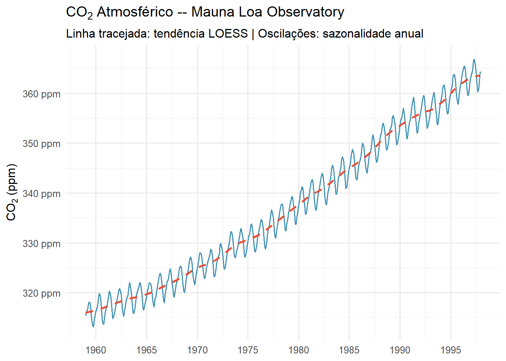
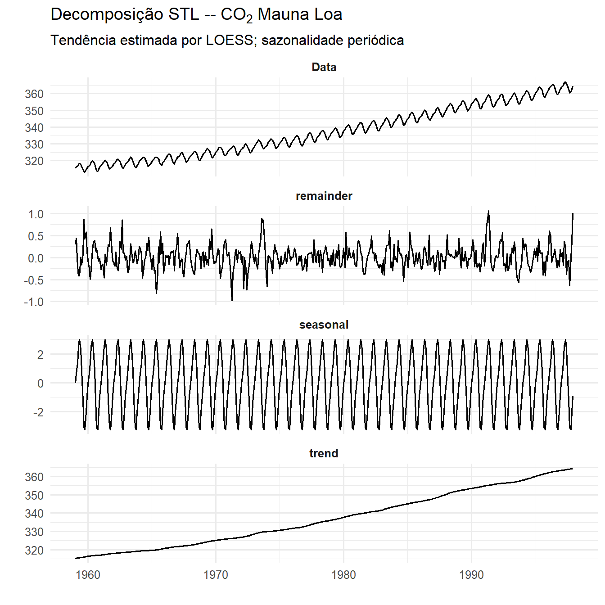
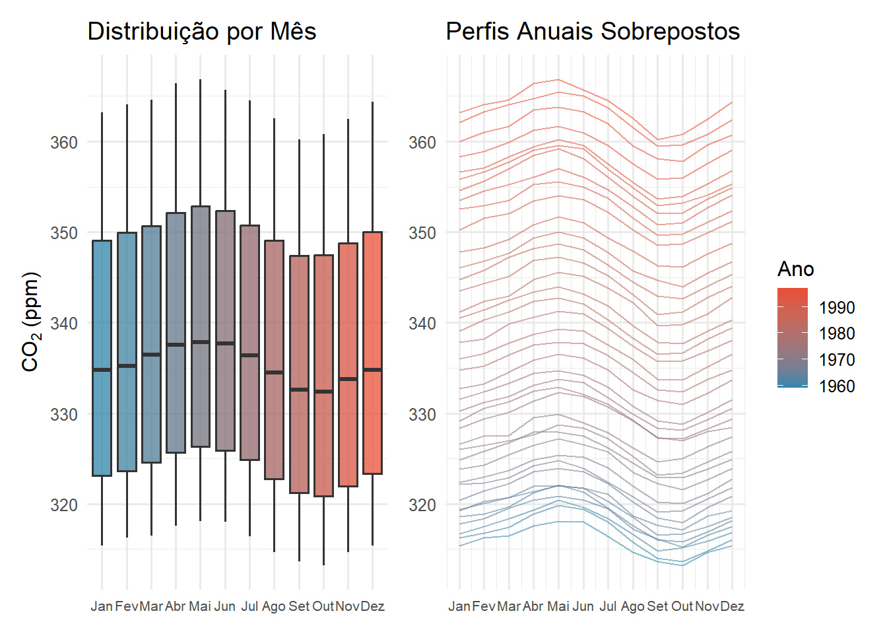
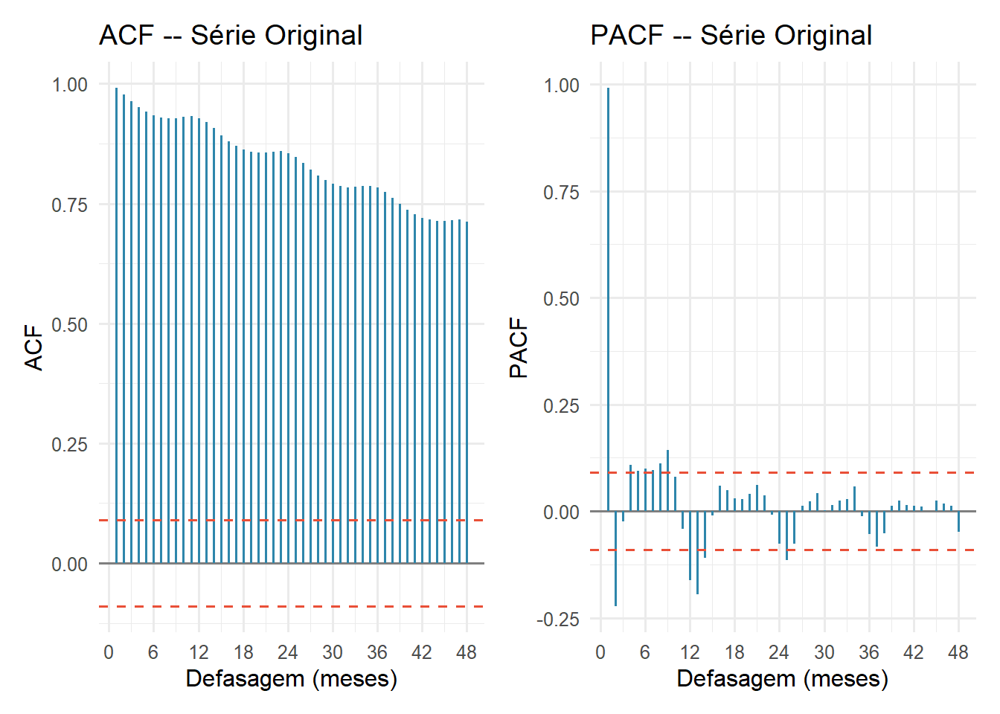
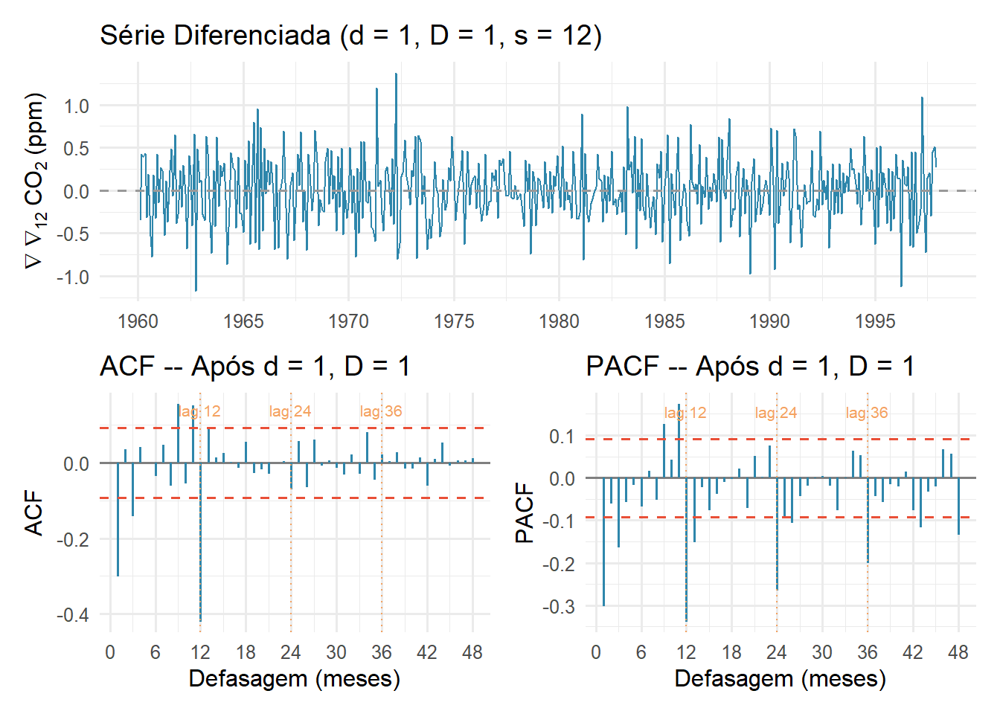
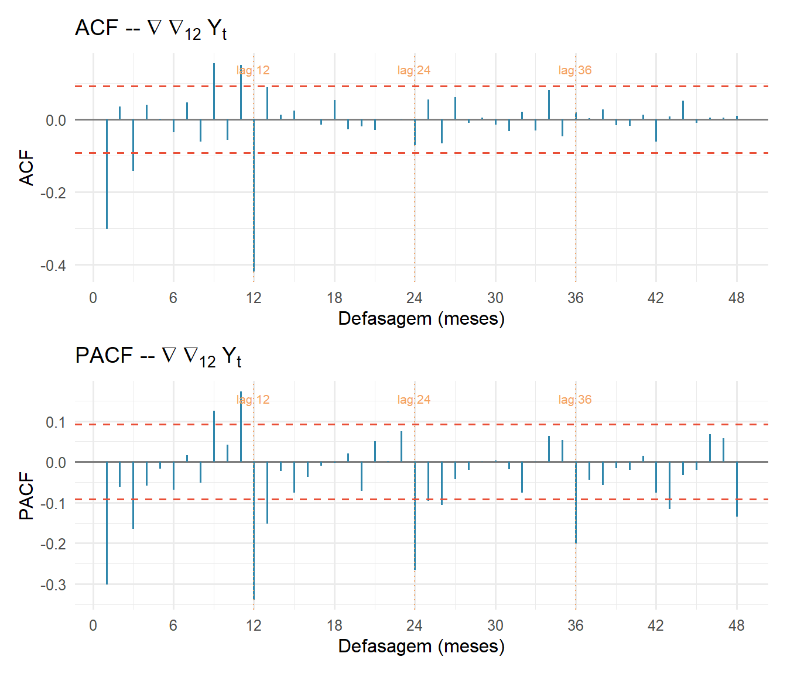
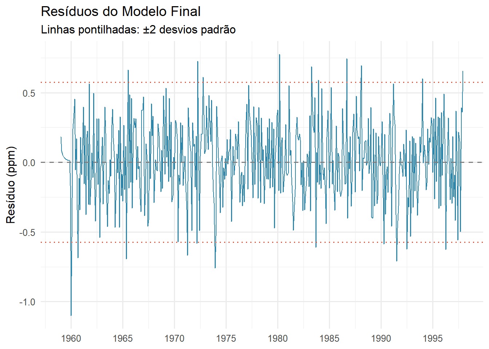
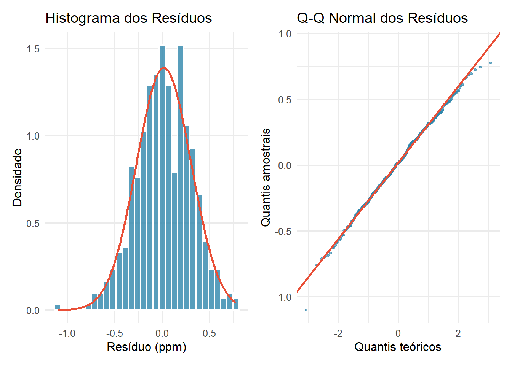
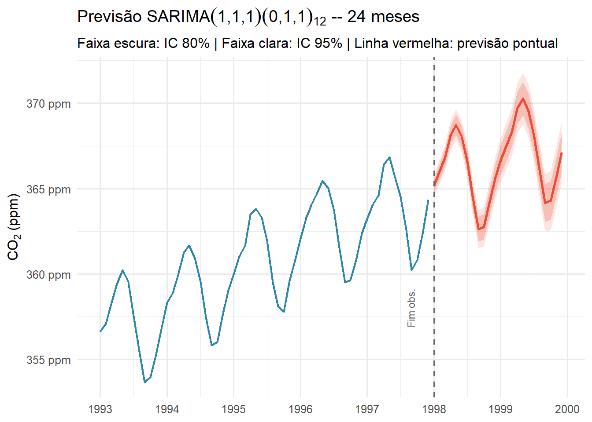

# CO₂ Atmosférico em Mauna Loa — Análise SARIMA

**Análise de Séries Temporais — Trabalho 1 (2026/1)**  
DME / Instituto de Matemática — UFRJ

> **Autores:** Arthur Pontes Motta e Catarine Martins  
> **Professor:** João Batista de Morais Pereira

---

## Relatório

[](https://arthurpmotta02.github.io/co2-mauna-loa-sarima/)

O relatório está disponível em formato interativo:

- **[Versão interativa](https://arthurpmotta02.github.io/co2-mauna-loa-sarima/)** — gráficos com código R expansível, tabelas completas e resultados inline (GitHub Pages)

---

## Sobre o trabalho

Análise completa da série temporal `co2` (disponível nativamente no R), contendo as concentrações médias mensais de CO₂ atmosférico medidas pelo **Observatório de Mauna Loa**, no Havaí, de janeiro de 1959 a dezembro de 1997 (468 observações mensais).

A série é conhecida mundialmente como **Curva de Keeling** — a mais longa e precisa série contínua de CO₂ atmosférico disponível — e combina dois fenômenos de grande interesse estatístico e científico: tendência crescente de longo prazo (acúmulo antropogênico de CO₂) e sazonalidade anual regular (ciclo de fotossíntese e respiração vegetal do hemisfério norte).

---

## Estrutura do trabalho

| Seção | Conteúdo |
|-------|----------|
| **2** | Análise descritiva: visualização da série, decomposição STL, padrão sazonal e taxa de crescimento anual |
| **3** | Identificação: testes de estacionariedade (ADF/KPSS), leitura de ACF/PACF, escolha das ordens $p, q, P, Q$ |
| **4** | Ajuste: comparação de 7 modelos SARIMA candidatos por AIC, AICc e BIC; estimação por máxima verossimilhança |
| **5** | Diagnóstico: autocorrelação (Ljung-Box), normalidade (Shapiro-Wilk e Jarque-Bera), homoscedasticidade |
| **6** | Previsão: projeções para 1998–1999 com IC 80% e 95%; modelo de regressão com erros ARMA como alternativa |

---

## Resultados principais

### Modelo selecionado

**SARIMA(1,1,1)(0,1,1)₁₂** — selecionado por parcimônia diante de empate técnico ($\Delta\text{AICc} < 0{,}3$) entre os três melhores candidatos (Burnham & Anderson, 2002).

$$W_t = (1-B)(1-B^{12})\,Y_t, \qquad (1 - \hat{\varphi}_1 B)\,W_t = (1 + \hat{\theta}_1 B)(1 + \hat{\tilde{\theta}}_1 B^{12})\,\varepsilon_t$$

| Parâmetro | Estimativa | IC 95% | p-valor |
|-----------|------------|--------|---------|
| $\hat{\varphi}_1$ (AR não-sazonal) | $0{,}2399$ | $(−0{,}041;\;0{,}520)$ | $0{,}094$ |
| $\hat{\theta}_1$ (MA não-sazonal) | $−0{,}5710$ | $(−0{,}813;\;−0{,}329)$ | $< 0{,}001$ |
| $\hat{\tilde{\theta}}_1$ (SMA sazonal, lag 12) | $−0{,}8516$ | $(−0{,}902;\;−0{,}801)$ | $< 0{,}001$ |

### Seleção de modelos

| Modelo | k | AICc | BIC | ΔAICc | ΔBIC |
|--------|---|------|-----|-------|------|
| SARIMA(2,1,1)(0,1,1)₁₂ | 4 | 177,96 | 198,43 | 0,00 | 7,91 |
| **SARIMA(1,1,1)(0,1,1)₁₂** | **3** | **178,16** | **194,55** | **0,20** | **4,03** |
| SARIMA(0,1,1)(0,1,1)₁₂ | 2 | 178,21 | 190,52 | 0,25 | 0,00 |
| SARIMA(0,1,2)(0,1,1)₁₂ | 3 | 179,18 | 195,57 | 1,22 | 5,05 |
| SARIMA(1,1,1)(1,1,1)₁₂ | 4 | 179,89 | 200,36 | 1,93 | 9,84 |
| SARIMA(0,1,1)(1,1,1)₁₂ | 3 | 180,01 | 196,40 | 2,05 | 5,88 |
| SARIMA(1,1,0)(0,1,1)₁₂ | 2 | 184,23 | 196,54 | 6,27 | 6,02 |

### Diagnóstico

| Diagnóstico | Valor | Conclusão |
|-------------|-------|-----------|
| Ljung-Box ($h = 12$) | $p = 0{,}2355$ | Sem autocorrelação |
| Ljung-Box ($h = 48$) | $p = 0{,}4070$ | Sem autocorrelação |
| Shapiro-Wilk | $p = 0{,}5316$ | Normalidade não rejeitada |
| Jarque-Bera | $p = 0{,}3830$ | Normalidade não rejeitada |

### Previsão

| Mês | Previsão pontual | IC 95% |
|-----|-----------------|--------|
| Dezembro/1998 | 365,60 ppm | $(364{,}36;\;366{,}84)$ |
| Dezembro/1999 | 367,14 ppm | $(365{,}34;\;368{,}94)$ |

A largura do IC 95% cresce de $\approx \pm 0{,}5$ ppm ($h=1$) a $\approx \pm 2{,}0$ ppm ($h=24$) — erro relativo inferior a 0,6% em toda a janela de previsão.

---

## Visualizações

### Série original e decomposição

**Série CO₂ Mauna Loa (1959–1997)**



**Decomposição STL**



**Padrão sazonal e taxa de crescimento**



---

### Identificação

**ACF e PACF da série original**



**Diferenciações para estacionariedade**



**ACF e PACF para identificação**



---

### Diagnóstico e previsão

**Resíduos do modelo**



**Diagnóstico de normalidade**



**Previsões 1998–1999**



---

## Pacotes R utilizados

| Pacote | Função no trabalho |
|--------|--------------------|
| `forecast` | `auto.arima`, `Arima`, `forecast` — ajuste e previsão SARIMA |
| `tseries` | `adf.test`, `kpss.test` — testes de raiz unitária |
| `TSA` | Funções auxiliares de séries temporais |
| `ggplot2` | Visualizações |
| `patchwork` | Composição de múltiplos gráficos |
| `ggfortify` | `autoplot` para objetos `ts` e decomposição STL |
| `gt` | Tabelas com formatação profissional |
| `broom` | `tidy()` para extração de coeficientes |
| `tidyverse` | Manipulação e transformação de dados |

---

## Arquivos

```
.
├── .github/
│   └── workflows/
│       └── publish.yml       # GitHub Actions: renderiza e publica automaticamente
├── index.qmd                 # Documento-fonte (Quarto)
├── index.html                # Relatório renderizado (GitHub Pages)
├── references.bib            # Referências bibliográficas (ABNT)
├── figures/                  # PNGs de todas as figuras
├── .nojekyll                 # Necessário para GitHub Pages
└── README.md
```

> O relatório HTML é gerado automaticamente pelo GitHub Actions a cada `push` na branch `main` e publicado em [arthurpmotta02.github.io/co2-mauna-loa-sarima](https://arthurpmotta02.github.io/co2-mauna-loa-sarima/). Não há arquivo HTML versionado no repositório.

> **`.nojekyll`:** necessário para que o GitHub Pages sirva corretamente o `index.html` gerado pelo Quarto sem processamento Jekyll.

---

## Reprodução local

### Dependências R

```r
install.packages(c(
  "forecast", "tseries", "TSA",
  "ggplot2", "patchwork", "scales", "ggfortify",
  "gt", "broom", "tidyverse"
))
```

### Renderização

```bash
quarto render index.qmd
```

> O arquivo `index.html` será gerado na mesma pasta — autocontido (`embed-resources: true`), sem dependências externas. Os dados `co2` são carregados diretamente via `data(co2)` — nenhum arquivo externo necessário.

---

## Referências principais

- Brockwell, P. J.; Davis, R. A. *Introduction to Time Series and Forecasting*. 2. ed. Springer, 2010.
- Morettin, P. A.; Toloi, C. M. C. *Análise de Séries Temporais*. Edgard Blücher, 2004.
- Box, G. E. P. et al. *Time Series Analysis: Forecasting and Control*. 5. ed. Wiley, 2015.
- Keeling, C. D. et al. Atmospheric carbon dioxide variations at Mauna Loa Observatory. *Tellus*, 28(6), 538–551, 1976.
- Cleveland, R. B. et al. STL: A seasonal-trend decomposition procedure based on LOESS. *Journal of Official Statistics*, 6(1), 3–73, 1990.
- Burnham, K. P.; Anderson, D. R. *Model Selection and Multimodel Inference*. Springer, 2002.