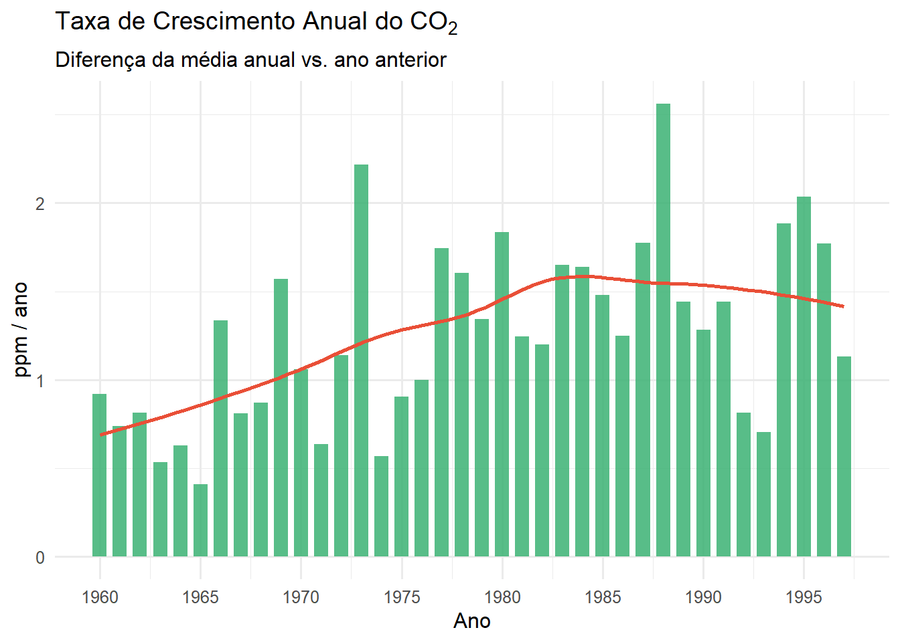
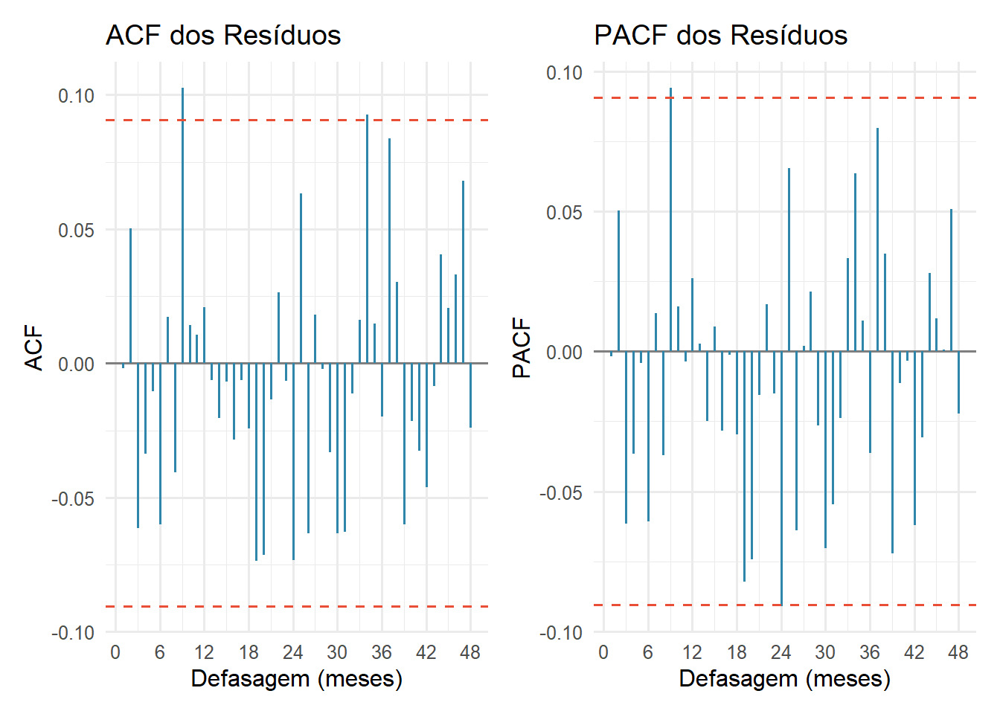
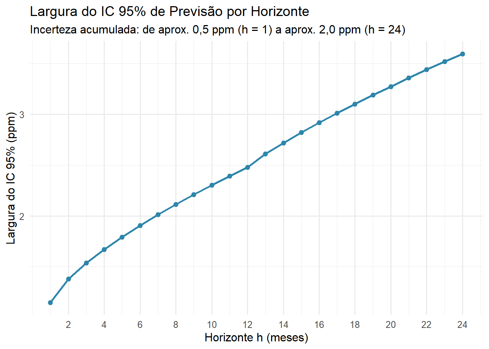

# CO₂ Atmosférico em Mauna Loa — Análise SARIMA

**Trabalho 1 — Análise de Séries Temporais**
> Disciplina: Análise de Séries Temporais — DME/IM-UFRJ  
> Autores: Arthur Motta & Catarine Martins

---

## Relatório interativo

O trabalho está publicado como página web com código recolhível, gráficos e tabelas completas:

### **[https://arthurpmotta02.github.io/co2-mauna-loa-sarima/](https://arthurpmotta02.github.io/co2-mauna-loa-sarima/)**

---

## Sobre o trabalho

Análise completa da série temporal `co2` (disponível nativamente no R), contendo as concentrações médias mensais de CO₂ atmosférico medidas pelo **Observatório de Mauna Loa**, localizado a 3.397 metros de altitude no vulcão Mauna Loa, Havaí, de janeiro de 1959 a dezembro de 1997 (468 observações mensais).

A série é conhecida mundialmente como **Curva de Keeling** — a mais longa e precisa série contínua de CO₂ atmosférico disponível — e é um caso de referência clássico na literatura de séries temporais por combinar dois fenômenos de grande interesse estatístico e científico:

1. **Tendência crescente de longo prazo:** acúmulo antropogênico de CO₂ proveniente da queima de combustíveis fósseis e desmatamento
2. **Sazonalidade anual regular:** ciclo de fotossíntese e respiração vegetal do hemisfério norte — CO₂ aumenta no inverno boreal (outubro–maio) e diminui no verão boreal (maio–setembro)

---

## Estrutura do trabalho

| Seção | Conteúdo |
|---|---|
| 2 | Análise descritiva: visualização da série, decomposição STL, padrão sazonal e taxa de crescimento anual |
| 3 | Identificação: testes de estacionariedade (ADF/KPSS), leitura de ACF/PACF, escolha das ordens p, q, P, Q |
| 4 | Ajuste: comparação de 7 modelos SARIMA candidatos por AIC, AICc e BIC; estimação por máxima verossimilhança |
| 5 | Diagnóstico: autocorrelação (Ljung-Box), normalidade (Shapiro-Wilk e Jarque-Bera), homoscedasticidade |
| 6 | Previsão: projeções para 1998–1999 com IC 80% e 95%; modelo de regressão com erros ARMA como alternativa |

---

## Definição do modelo SARIMA

Um processo $\{Y_t\}$ é $\text{SARIMA}(p, d, q)(P, D, Q)_s$ se a série diferenciada

$$W_t = (1-B)^d(1-B^s)^D Y_t$$

é um processo ARMA causal satisfazendo:

$$\Phi(B)\tilde{\Phi}(B^s)\,W_t = \Theta(B)\tilde{\Theta}(B^s)\,\varepsilon_t, \qquad \varepsilon_t \sim \mathcal{RB}(0, \sigma^2)$$

onde $\Phi(z) = 1 - \varphi_1 z - \cdots - \varphi_p z^p$ e $\tilde{\Theta}(z) = 1 + \tilde{\theta}_1 z + \cdots + \tilde{\theta}_Q z^Q$ são os polinômios AR/MA não-sazonais e sazonais, respectivamente.

Os parâmetros são estimados por **máxima verossimilhança** (método CSS-ML):

$$L(\Phi, \tilde{\Phi}, \Theta, \tilde{\Theta}, \sigma^2) = (2\pi)^{-n/2} \left(\prod_{j=1}^n \nu_{j-1}\right)^{-1/2} \exp\!\left(-\frac{1}{2}\sum_{j=1}^n \frac{(Y_j - \hat{Y}_j)^2}{\nu_{j-1}}\right)$$

onde $\hat{Y}_j$ é o melhor preditor linear de $Y_j$ e $\nu_{j-1} = E[(Y_j - \hat{Y}_j)^2]$.

---

## Modelo selecionado

**SARIMA(1,1,1)(0,1,1)₁₂**

Escrito explicitamente:

$$(1 - \hat{\varphi}_1 B)(1 - B)(1 - B^{12})\,Y_t = (1 + \hat{\theta}_1 B)(1 + \hat{\tilde{\theta}}_1 B^{12})\,\varepsilon_t, \qquad \varepsilon_t \sim \mathcal{RB}(0,\, \hat{\sigma}^2)$$

Selecionado por **parcimônia** diante de empate técnico ($\Delta\text{AICc} < 0{,}3$) entre os três melhores candidatos — critério de Burnham & Anderson (2002). Com apenas 3 parâmetros livres, oferece capacidade preditiva equivalente a modelos mais complexos com menor risco de sobreajuste.

| Parâmetro | Estimativa | Erro Padrão | IC 95% | p-valor |
|---|---|---|---|---|
| $\hat{\varphi}_1$ (AR não-sazonal) | 0,2399 | 0,1430 | (−0,041 ; 0,520) | 0,094 |
| $\hat{\theta}_1$ (MA não-sazonal) | −0,5710 | 0,1237 | (−0,813 ; −0,329) | < 0,001 |
| $\hat{\tilde{\theta}}_1$ (SMA sazonal, lag 12) | −0,8516 | 0,0256 | (−0,902 ; −0,801) | < 0,001 |

As raízes dos polinômios AR e MA estão fora do círculo unitário ($|\text{raiz}_{AR}| = 4{,}17$; $|\text{raiz}_{MA}| = 1{,}75$), garantindo **causalidade** e **invertibilidade**.

### Seleção de modelos

| Modelo | k | AIC | AICc | BIC | ΔAICc | ΔBIC |
|---|---|---|---|---|---|---|
| SARIMA(2,1,1)(0,1,1)₁₂ | 4 | 177,83 | 177,96 | 198,43 | 0,00 | 7,91 |
| **SARIMA(1,1,1)(0,1,1)₁₂** | **3** | **178,07** | **178,16** | **194,55** | **0,20** | **4,03** |
| SARIMA(0,1,1)(0,1,1)₁₂ | 2 | 178,16 | 178,21 | 190,52 | 0,25 | 0,00 |
| SARIMA(0,1,2)(0,1,1)₁₂ | 3 | 179,09 | 179,18 | 195,57 | 1,22 | 5,05 |
| SARIMA(1,1,1)(1,1,1)₁₂ | 4 | 179,76 | 179,89 | 200,36 | 1,93 | 9,84 |
| SARIMA(0,1,1)(1,1,1)₁₂ | 3 | 179,92 | 180,01 | 196,40 | 2,05 | 5,88 |
| SARIMA(1,1,0)(0,1,1)₁₂ | 2 | 184,18 | 184,23 | 196,54 | 6,27 | 6,02 |

---

## Diagnóstico

| Diagnóstico | Valor | Conclusão |
|---|---|---|
| Média dos resíduos | 0,01721 | Média aprox. zero |
| Assimetria amostral | −0,151 | Assimetria baixa |
| Excesso de curtose | 0,084 | Curtose próx. da normal |
| Ljung-Box (h = 12) | p = 0,2355 | Sem autocorrelação (não rejeita H₀) |
| Ljung-Box (h = 48) | p = 0,4070 | Sem autocorrelação (não rejeita H₀) |
| Shapiro-Wilk | p = 0,5316 | Normalidade não rejeitada |
| Jarque-Bera | p = 0,3830 | Normalidade não rejeitada |

---

## Previsão

O melhor previsor linear de $Y_{n+h}$ dado $\{Y_1, \ldots, Y_n\}$, denotado $P_n Y_{n+h}$, minimiza o erro quadrático médio de previsão:

$$E[(Y_{n+h} - P_n Y_{n+h})^2] = \sigma^2 \sum_{j=0}^{h-1} \psi_j^2$$

onde $\psi_j$ são os coeficientes da representação MA$(\infty)$ do processo. Os intervalos de previsão de $(1-\alpha) \times 100\%$ são:

$$P_n Y_{n+h} \pm z_{\alpha/2} \cdot \hat{\sigma} \sqrt{\sum_{j=0}^{h-1} \hat{\psi}_j^2}$$

| Mês | Previsão pontual | IC 95% Inf | IC 95% Sup |
|---|---|---|---|
| Dezembro/1998 | 365,60 ppm | 364,36 | 366,84 |
| Dezembro/1999 | 367,14 ppm | 365,34 | 368,94 |

A largura do IC 95% cresce de $\approx \pm 0{,}5$ ppm ($h=1$) a $\approx \pm 2{,}0$ ppm ($h=24$), representando erro relativo inferior a 0,6% em toda a janela de previsão.

---

## Modelo de regressão com erros ARMA (sinal + ruído)

Como alternativa ao SARIMA, ajustou-se o modelo:

$$Y_t = \beta_0 + \beta_1 t + \sum_{k=1}^{2} \left[\alpha_k \cos\!\left(\frac{2\pi k t}{12}\right) + \delta_k \sin\!\left(\frac{2\pi k t}{12}\right)\right] + W_t, \qquad W_t \sim \text{ARMA}(1,1)$$

com $K = 2$ harmônicos de Fourier para parcimônia. Comparação com o SARIMA:

| Modelo | Parâmetros | AICc | BIC | $\hat{\sigma}^2$ |
|---|---|---|---|---|
| SARIMA(1,1,1)(0,1,1)₁₂ | 3 | 178,16 | 194,55 | 0,08560 |
| Regressão + ARMA(1,1) | 8 | 282,63 | 319,57 | 0,10391 |

O SARIMA é preferido por AICc e parcimônia. A abordagem de regressão tem valor quando o interesse recai sobre a interpretação direta de $\hat{\beta}_1$ (taxa de crescimento anual) ou da amplitude e fase dos harmônicos sazonais.

---

## Visualizações

### Série original


Concentração mensal de CO₂ em Mauna Loa (1959–1997). A linha tracejada é a tendência LOESS. Tendência crescente monotônica e oscilação sazonal anual de ~6 ppm são imediatamente visíveis. A variância das oscilações sazonais é estável ao longo do tempo, dispensando transformação logarítmica.

---

### Decomposição STL


Decomposição STL da série: tendência perfeitamente monotônica (sugestiva de $d = 1$), sazonalidade praticamente constante ao longo das décadas (valida $D = 1$ em vez de componente determinístico separado) e resíduo em torno de zero com variância ligeiramente heterogênea associada ao El Niño de 1982–83.

---

### Padrão sazonal


Boxplot mensal (esq.) e perfis anuais sobrepostos (dir.). O CO₂ aumenta de outubro a maio e diminui de maio a setembro. A amplitude de ~6 ppm é praticamente idêntica em todos os anos, reforçando a adequação de um componente sazonal estocástico com período $s = 12$.

---

### Taxa de crescimento anual



Diferença da média anual de CO₂ em relação ao ano anterior. O crescimento é consistente ao longo de toda a série, com taxa média de ~1,23 ppm/ano e aceleração visível após 1980.

---

### ACF e PACF da série original


O decaimento extremamente lento da ACF (ainda significativa na defasagem 48) é característica clássica de série não estacionária com tendência. O padrão senoidal com período 12 evidencia a sazonalidade.

---

### Diferenciações para estacionariedade


Após $d = 1$ e $D = 1$ ($s = 12$), a série $\nabla\nabla_{12}Y_t = (1-B)(1-B^{12})Y_t$ é visualmente estacionária. Confirmado pelos testes ADF ($p < 0{,}05$) e KPSS ($p > 0{,}10$).

---

### ACF e PACF para identificação


ACF e PACF da série estacionária $\nabla\nabla_{12}Y_t$ com destaque nos lags sazonais (múltiplos de 12). ACF com pico negativo no lag 1 e corte no lag 12 → MA(1) + SMA(1). PACF com decaimento exponencial → confirmação da componente MA.

---

### Resíduos do modelo


Resíduos do SARIMA$(1,1,1)(0,1,1)_{12}$ com bandas $\pm 2\hat{\sigma}$. Flutuação em torno de zero com variância aproximadamente constante ao longo do tempo — sem padrão visível que indique inadequação do modelo.

---

### ACF e PACF dos resíduos



Nenhuma autocorrelação significativa em qualquer defasagem (dentro das bandas $\pm 1{,}96/\sqrt{n}$). O modelo capturou toda a estrutura de dependência linear da série.

---

### Diagnóstico de normalidade


Histograma com curva normal sobreposta (esq.) e gráfico Q-Q (dir.). Shapiro-Wilk $p = 0{,}532$ e Jarque-Bera $p = 0{,}383$ — normalidade não rejeitada em nenhum dos testes formais.

---

### Previsões 1998–1999


Previsões para 24 meses com IC 80% (faixa escura) e IC 95% (faixa clara). A série observada de 1993 a 1997 é mostrada à esquerda da linha de corte. O modelo preserva fielmente o crescimento monotônico e a sazonalidade anual.

---

### Incerteza de previsão



Largura do IC 95% em função do horizonte $h$. Cresce de $\approx 0{,}5$ ppm ($h = 1$) a $\approx 2{,}0$ ppm ($h = 24$) — erro relativo inferior a 0,6% em toda a janela de previsão.

---

## Pacotes R utilizados

| Pacote | Função no trabalho |
|---|---|
| `forecast` | `auto.arima`, `Arima`, `forecast` — ajuste e previsão SARIMA |
| `tseries` | `adf.test`, `kpss.test` — testes de raiz unitária |
| `TSA` | Funções auxiliares de séries temporais |
| `ggplot2` | Visualizações |
| `patchwork` | Composição de múltiplos gráficos |
| `ggfortify` | `autoplot` para objetos `ts` e decomposição STL |
| `gt` | Tabelas com formatação profissional |
| `broom` | `tidy()` para extração de coeficientes |
| `tidyverse` | Manipulação e transformação de dados |

---

## Arquivos

```
.
├── .github/
│   └── workflows/
│       └── publish.yml                 # GitHub Actions: renderiza e publica automaticamente
├── Trabalho1_SeriesTemporais_CO2.qmd   # Documento-fonte (Quarto)
├── references.bib                      # Referências bibliográficas
└── README.md
```

> O relatório HTML é gerado automaticamente pelo GitHub Actions a cada `push` na branch `main` e publicado em [arthurpmotta02.github.io/co2-mauna-loa-sarima](https://arthurpmotta02.github.io/co2-mauna-loa-sarima/). Não há arquivo HTML versionado no repositório.

---

## Reprodução local

### Dependências R

```r
install.packages(c(
  "forecast", "tseries", "TSA",
  "ggplot2", "patchwork", "scales", "ggfortify",
  "gt", "broom", "tidyverse"
))
```

### Renderização

```bash
quarto render Trabalho1_SeriesTemporais_CO2.qmd
```

O arquivo `Trabalho1_SeriesTemporais_CO2.html` será gerado na mesma pasta — autocontido (`embed-resources: true`), sem dependências externas.

---

## Referências principais

- Brockwell, P.J.; Davis, R.A. *Introduction to Time Series and Forecasting*. 2. ed. Springer, 2010.
- Morettin, P.A.; Toloi, C.M.C. *Análise de Séries Temporais*. Edgard Blücher, 2004.
- Box, G.E.P. et al. *Time Series Analysis: Forecasting and Control*. 5. ed. Wiley, 2015.
- Keeling, C.D. et al. Atmospheric carbon dioxide variations at Mauna Loa Observatory. *Tellus*, 28(6), 538–551, 1976.
- Cleveland, R.B. et al. STL: A seasonal-trend decomposition procedure based on LOESS. *Journal of Official Statistics*, 6(1), 3–73, 1990.
- Burnham, K.P.; Anderson, D.R. *Model Selection and Multimodel Inference*. Springer, 2002.